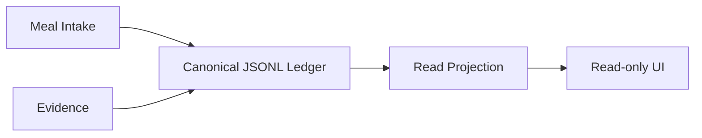

# 2026-09-27 Nutrition Dogfood 收口计划

关联：
https://github.com/EOMZON/nutrition-ledger-mvp/issues/33

## 当前状态

Canonical local-first writer 边界稳定。当前剩余动作是既有 2026-09-23 lunch 的 canonical ledger 落盘。

## 理想架构

## 数据/UI 分离

- JSONL ledger 是 canonical data；
- evidence 是 provenance；
- projection 是查询/展示模型；
- UI 不直接写 canonical ledger；
- 未来 cloud persistence 不能产生第二 canonical writer。

## Ideal vs Current

| 能力 | Ideal | Current |
|---|---|---|
| Canonical ledger | 单一 writer | 边界明确 |
| Evidence | 可追溯 | 已有 contract |
| Projection | 只读展示 | 已有页面 |
| Dogfood | 连续真实记录 | 2026-09-23 lunch 尚未证明完成 |
| Cloud persistence | 独立后续阶段 | 不应阻塞当前 dogfood |

## TODO

### 本机处理
- [ ] 在 canonical Mac ledger 落盘 2026-09-23 lunch
- [ ] readback 核对
- [ ] 记录 evidence

### 云端
- [ ] 不在本阶段创建第二 ledger
- [ ] 未来如需 cloud persistence，另建 L2/L3 execution phase

## 时间节点

2026-09-27：完成文档与 issue 边界；
下一步：**本机处理**既有 dogfood。
