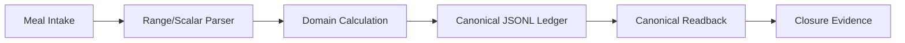

# 2026-09-28 Nutrition Closure Record

关联：#33、#35。

## 状态

- #33：DOGFOOD PASS / CLOSED
- #35：PARSER + DOMAIN SAFETY + CANONICAL READBACK + EVIDENCE PASS / CLOSED

## Mermaid

## Ideal vs Current

| 能力 | Ideal | Current |
|---|---|---|
| Single canonical writer | 单 writer | PASS |
| Range/scalar boundary | 不把区间当单值 | PASS |
| Provenance | 可追溯 | PASS |
| Real dogfood | canonical Mac ledger | PASS |
| Cloud persistence | 独立未来阶段 | 未纳入当前主线 |

## TODO

- [x] #33 real dogfood
- [x] #35 parser regression
- [x] #35 domain safety
- [x] canonical ledger readback
- [x] evidence 保存
- [ ] 未来 cloud persistence（独立阶段，不阻塞当前主线）

## 时间节点

- 2026-09-23：真实 lunch dogfood
- 2026-09-27：closure baseline
- 2026-09-28：#33/#35 从主线执行清单移除
