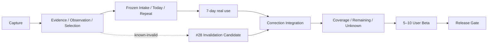
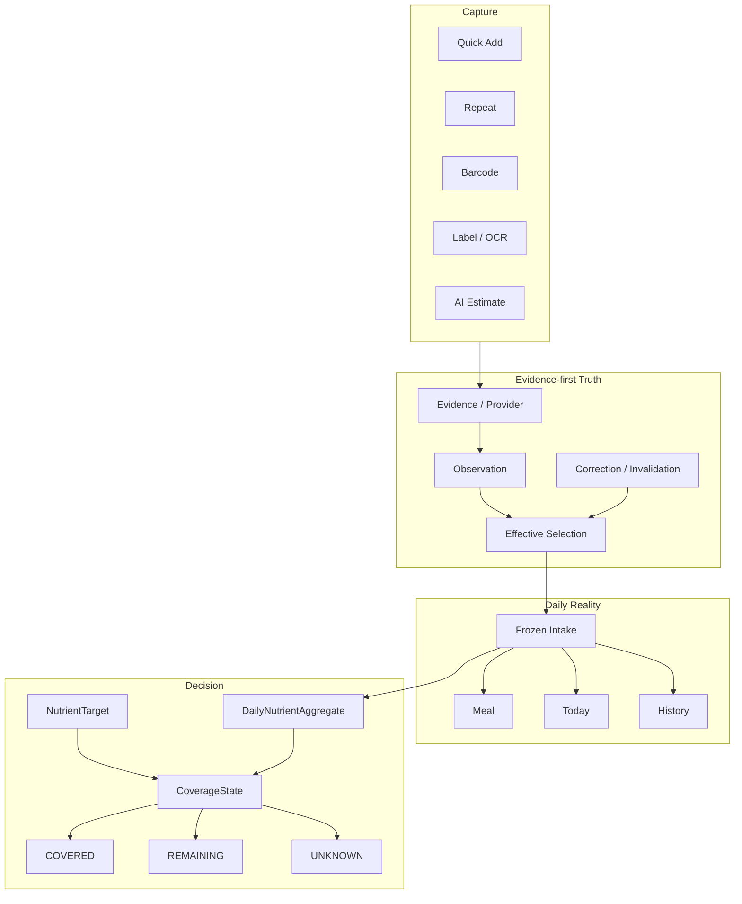

# Nutrition 主线全盘复盘：最初目标、当前状态、差距与时间线

日期：2026-09-18 晚间  
业务仓：`EOMZON/nutrition-ledger-mvp`  
当前 integration target：`test@244f4c188993e0633833a0b9fd936afedb29605c`  
正式基线：`main@298cd1f1e46a62d1cd83efca79be73edbadd6c32`（未推广）

## 1. 最初目标

最初目标不是做大而全营养平台，而是：

```text
吃了什么
→ 快速记录
→ 来源可见
→ 错了可修
→ 历史不被静默重写
→ 下次快速复用
→ 每天真的愿意使用
→ 最后回答“今天还差什么”
```

XHS 31/31 评论验证的下一层价值：

```text
今天哪些已覆盖？
哪些还剩？
哪些只是数据未知？
```

最终产品定义保持：

> Evidence-first Personal Nutrition Ledger：低摩擦记录真实饮食，保留营养数据来源、不确定性与历史真相；在用户明确设定/选择目标后，给出 COVERED / REMAINING / UNKNOWN。

## 2. 当前状态

### 2.1 Git / consumer

```text
main = 298cd1f1e46a62d1cd83efca79be73edbadd6c32
test = 244f4c188993e0633833a0b9fd936afedb29605c
canonical = /Users/zon/Desktop/MINE/html/nutrition-ledger-mvp
consumer = CONSUMER_VERIFIED
worktree = 1
local branches = 0
```

#24 / #25 已完成，误建立的 fresh clone 已退出，private data / blobs preserved。

### 2.2 Dogfood

- Day 1：PASS
- Day 2：PASS
- Day 3–7：PENDING

Day 2 脱敏证据：

```text
eatingEvents = 1
medianSeconds = 0.315
p90Seconds = 0.315
manualCorrections = 0
structuralRepairs = 0
silentHistoricalChanges = 0
sourceMissingCount = 0
unknownNutritionCount = 0
audit = PASS
```

Canonical Issue：
https://github.com/EOMZON/nutrition-ledger-mvp/issues/18

### 2.3 Parser

NRV parser #19 已修复并进入 `test@244f4c1...`：

- 无显式百分号不再生成 `*_nrv_pct`
- 显式百分号仍正常
- 本机 real-data readback PASS

### 2.4 Historical correction

旧 parser 留下 3 条 known-invalid NRV observation。

#28 已有完整 verified candidate：

https://github.com/EOMZON/nutrition-ledger-mvp/issues/28  
https://github.com/EOMZON/nutrition-ledger-mvp/pull/29

Candidate：
`60b8dc0fbc7056b6b359f05149c4cf0c71e84fe9`

状态：

```text
CANDIDATE_VERIFIED
INTEGRATION_DEFERRED
REAL_LEDGER_NOT_MUTATED
TEST_NOT_MOVED
```

实现：
- append-only `observation.invalidate`
- active / invalidated resolver
- selected-invalidated explicit unresolved
- no silent fallback
- audit
- History UI
- frozen intake 不回写

验证：
- unit 14/14
- browser 13/13
- visual 2/2
- isolated audit PASS

保持 Draft 是有意设计：7-day 期间冻结 runtime baseline。

### 2.5 Coverage

#26 仍 BLOCKED：

https://github.com/EOMZON/nutrition-ledger-mvp/issues/26

依赖：
- #18 7-day
- #28 correction integration

## 3. 当前架构位置



## 4. 理想架构



核心不变量：

```text
UNKNOWN != 0
UNKNOWN != REMAINING
invalidated observation != deleted history
target change != rewrite historical intake
AI estimate != verified truth
```

## 5. 当前 vs 理想

| 层 | 当前 | 理想 | 差距 |
|---|---|---|---|
| Capture | 基本完成 | 日用低摩擦 | 继续真实使用验证 |
| Provenance | 完成 | 全链可解释 | 无重大结构缺口 |
| Correction | verified candidate | 已集成 + real correction | 等 7-day integration node |
| Daily | 工程闭环 | 连续自然使用 | Day 3–7 |
| Coverage | 未实现 | Covered/Remaining/Unknown | #18 + #28 后启动 |
| Beta | 未开始 | 5–10 真实用户 | Coverage 后 |
| Production | 暂停 | 受控正式发布 | Beta / #59 后 |

## 6. 时间线

| 日期 | 节点 | 状态 |
|---|---|---|
| 2026-08-31 | 历史 Preview / Production 验证 | 历史证据 |
| 2026-09-17 | Today P1 合入 test | 完成 |
| 2026-09-17 | real-data audit + Day 1 | PASS |
| 2026-09-17 | dogfood 暴露 NRV parser bug | 已修复 |
| 2026-09-18 | parser fix 进入 test@244f4c1 | 完成 |
| 2026-09-18 | canonical resync / consumer readback | 完成 |
| 2026-09-18 | Day 2 | PASS |
| 2026-09-18 | #28 correction candidate | VERIFIED / DEFERRED |
| 2026-09-19~ | Day 3–7 | 待自然发生 |
| 7-day 后 | correction integration | 待执行 |
| correction 后 | Coverage MVP | BLOCKED |
| Coverage 后 | Beta | 待开始 |
| Beta 后 | Release Gate | 待开始 |

## 7. 当前最重要差距

```text
不是：
更多 provider
更多营养字段
更多 dashboard

而是：
真实连续使用
→ 历史错误安全修正
→ 今天还差什么
```

## 8. 当前决策

现在做：
1. 冻结 `test@244f4c1...`
2. 完成 Day 3–7
3. 保持 #29 Draft，不堆零碎提交
4. Day 7 后重新 compare / integrate #29
5. exact-SHA verify + consumer resync
6. 真实 3 条旧 NRV append-only correction
7. 启动 #26

现在不做：
- 菜谱
- 库存
- 购物
- 社区
- AI 医疗建议
- Apple Health 总控
- 新数据库
- framework 重写
- test→main
- Production

## 9. Canonical links

业务：
- https://github.com/EOMZON/nutrition-ledger-mvp/issues/10
- https://github.com/EOMZON/nutrition-ledger-mvp/issues/18
- https://github.com/EOMZON/nutrition-ledger-mvp/issues/28
- https://github.com/EOMZON/nutrition-ledger-mvp/issues/26

跨仓：
- https://github.com/EOMZON/creationos-os/issues/59
- https://github.com/EOMZON/creationos-os/issues/128
- https://github.com/EOMZON/codex-skills-private/issues/29
