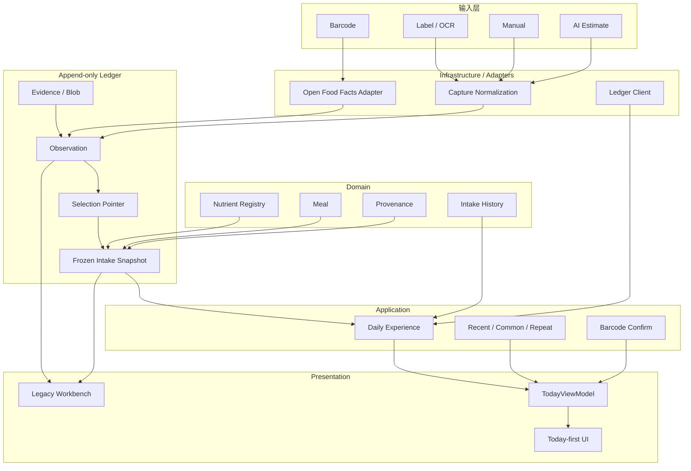
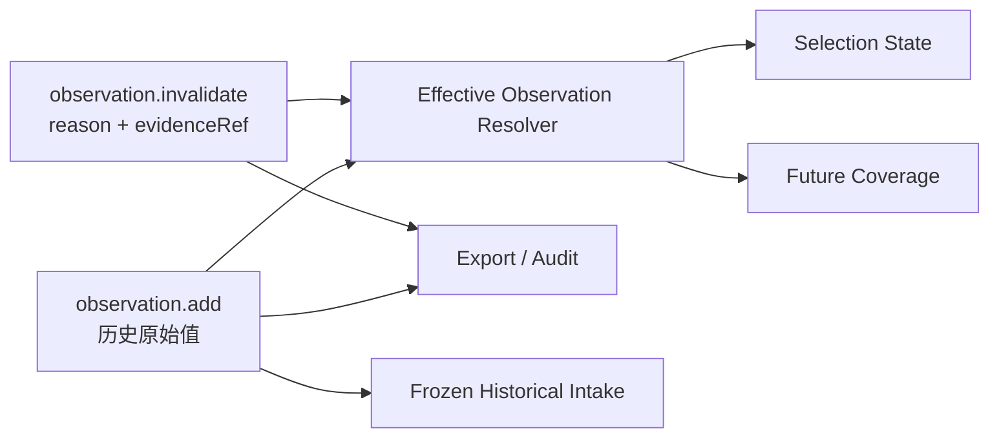
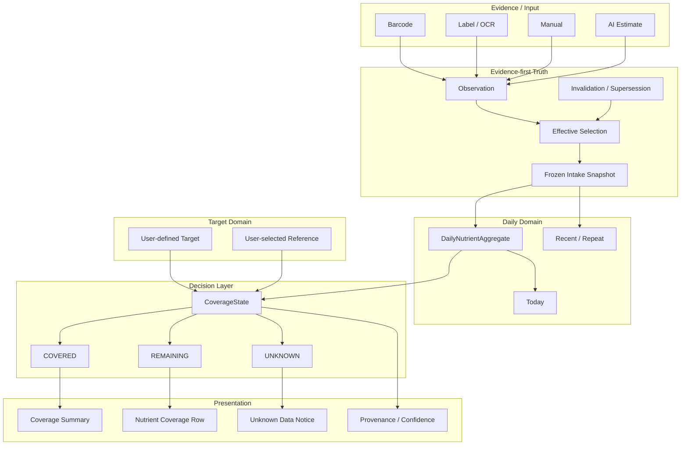
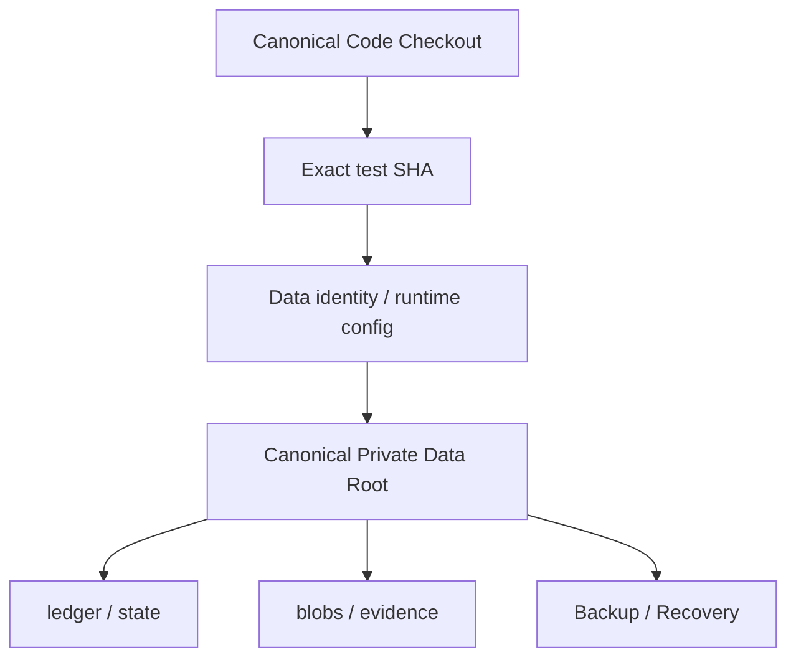

# Nutrition 当前架构 vs 理想架构

日期：2026-09-18 晚间  
状态：docs-only architecture reference，不构成 runtime 变更。

## 0. 当前状态

```text
main = 298cd1f1e46a62d1cd83efca79be73edbadd6c32
test = 244f4c188993e0633833a0b9fd936afedb29605c
canonical consumer = VERIFIED
Day 1 = PASS
Day 2 = PASS
Day 3–7 = PENDING
#28 correction = CANDIDATE_VERIFIED / INTEGRATION_DEFERRED
#26 Coverage = BLOCKED ON #18 + #28
Production = NOT PROMOTED
```

## 1. 当前已实现架构



## 2. 当前数据流硬规则

```text
raw evidence/provider
→ observation
→ effective selection
→ frozen intake snapshot
→ daily read model
→ Today UI
```

UI 禁止：
- 直接修改历史 observation；
- 从 DOM 推导营养事实；
- 直接拼 provider 结果；
- 把缺失值默认为 0；
- 把 AI estimate 当 verified。

## 3. Correction：从架构缺口推进到 verified candidate

历史 parser bug 暴露的缺口：

```text
observation.add
→ observation.invalidate
→ effective resolver
```

当前已经有 verified Draft candidate：

https://github.com/EOMZON/nutrition-ledger-mvp/pull/29

Candidate：
`60b8dc0fbc7056b6b359f05149c4cf0c71e84fe9`



已验证语义：
- 原始 observation 永久保留；
- invalidation append-only；
- invalidated observation 不参与默认选择；
- selected invalidated 明确返回 unresolved；
- 不静默 fallback；
- History 显示 invalidated + reason；
- frozen historical intake 不回写；
- audit 可发现 dangling invalidation / invalidated selection。

当前仍未：
- merge test；
- 修改真实 private ledger；
- 对真实 3 条 known-invalid NRV 执行 correction。

原因：7-day dogfood 要保持稳定 runtime baseline。

## 4. 理想最终产品架构



核心不变量：

```text
UNKNOWN != 0
UNKNOWN != REMAINING
invalidated observation != deleted history
target change != rewrite historical intake
AI estimate != verified truth
```

## 5. 当前 → 理想差距

| 层 | 当前 | 理想 | 下一 Gate |
|---|---|---|---|
| Capture | 基本完成 | 日用低摩擦 | Day3–7 |
| Provenance | 完成 | 全链可解释 | 继续 dogfood |
| Correction | verified candidate | integrated + real correction | Day7 后 |
| Daily | Day1/2 PASS | 7-day natural use | #18 |
| Coverage | 未实现 | Covered/Remaining/Unknown | #18 + #28 |
| Beta | 未开始 | 5–10 用户 | Coverage 后 |
| Production | 暂停 | 受控上线 | #59 |

## 6. 本地运行身份



Canonical：

```text
/Users/zon/Desktop/MINE/html/nutrition-ledger-mvp
```

7-day 期间不移动 private data root。

## 7. Worktree / Merge Synchronization

必须区分：

```text
git worktree count
!= machine-wide clone count
!= consumer freshness
!= private data continuity
```

以及：

```text
SOURCE_SAVED
!= MERGED
!= SEMANTICALLY_RECONCILED
!= TARGET_VERIFIED
!= CONSUMER_UPDATED
```

本轮已经真实证明：只有 PR merged / target CI PASS 不足以证明 canonical consumer 已更新；#24/#25 的 live readback 才完成最终闭环。

参考：
https://github.com/EOMZON/codex-skills-private/issues/29
