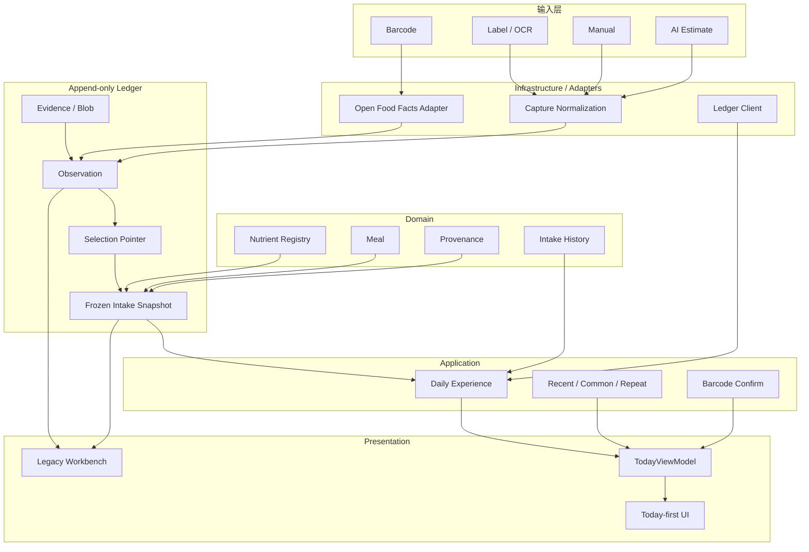
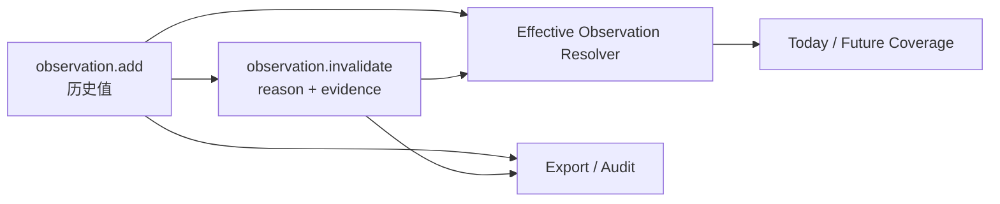
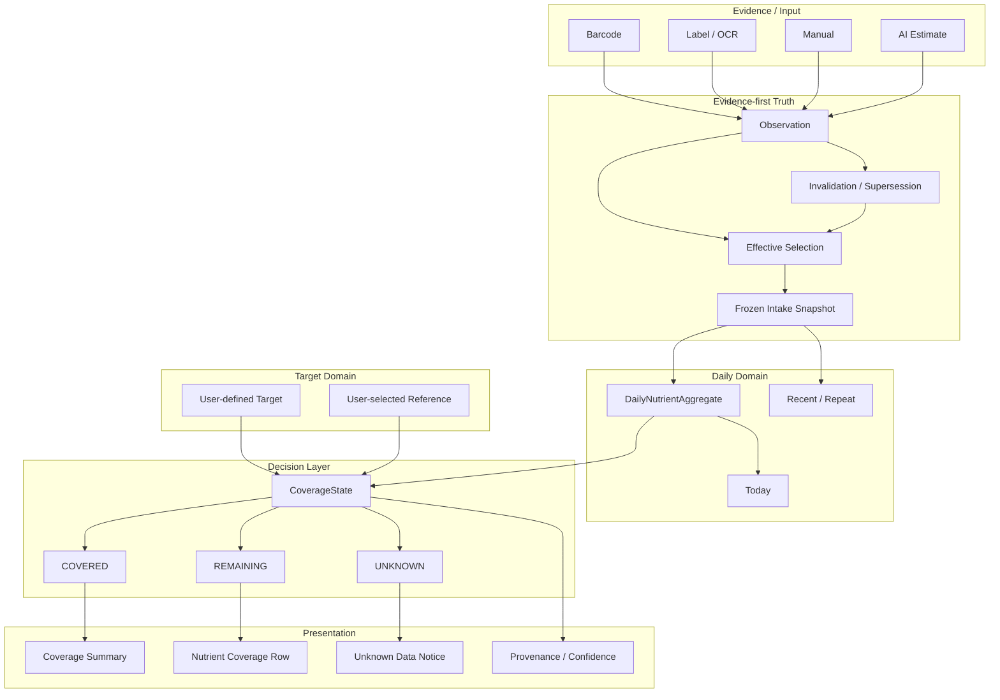
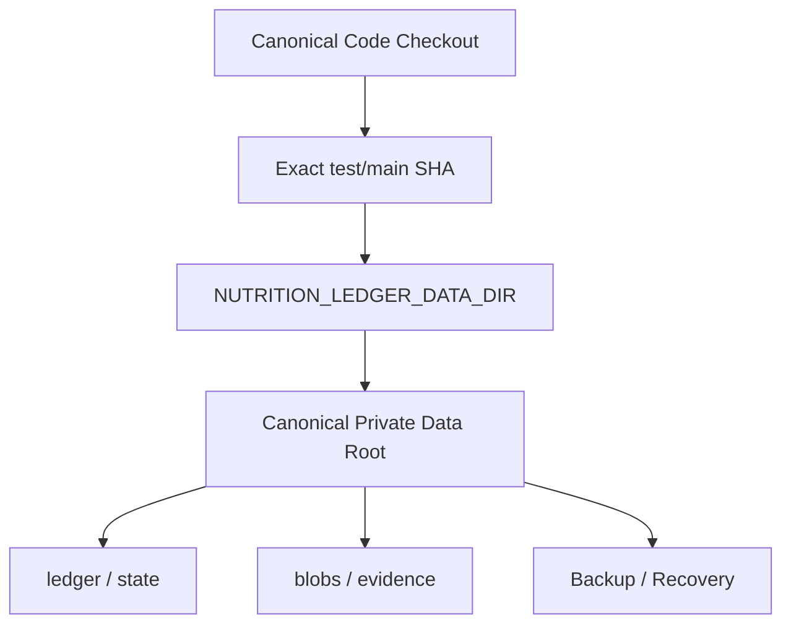

# Nutrition 当前架构 vs 理想架构

日期：2026-09-18  
状态：docs-only architecture reference，不构成 runtime 变更。

## 1. 当前已实现架构



## 2. 当前数据流硬规则

```text
raw evidence/provider
→ observation
→ effective selection
→ frozen intake snapshot
→ daily read model
→ Today UI
```

UI 禁止：
- 直接修改历史 observation；
- 从 DOM 推导营养事实；
- 直接拼 provider 结果；
- 把缺失值默认为 0；
- 把 AI estimate 当 verified。

## 3. 当前已知缺口：Correction

当前 append-only 模型能表达：

```text
observation.add
selection
intake.add
intake.patch
intake.void
```

但历史 parser bug 暴露出还缺：

```text
observation.invalidate
或
observation.supersede
```

理想 correction：



要求：
- 原始 observation 永远保留；
- invalidation 也是 append-only；
- effective resolver 排除 invalidated observation；
- audit/export 保留完整链；
- 历史 frozen intake 不回写；
- 后续 Coverage 不消费 known-invalid observation。

## 4. 理想最终产品架构



核心不变量：

```text
UNKNOWN != 0
UNKNOWN != REMAINING
invalidated observation != deleted history
target change != rewrite historical intake
```

## 5. 本地运行理想架构

当前 canonical 已收口为真实私人 ledger checkout：

```text
/Users/zon/Desktop/MINE/html/nutrition-ledger-mvp
```

建议未来把代码身份与数据身份显式区分：



7-day dogfood 中不移动 private data root；等 dogfood 完成后再决定是否把 data root 从 repo checkout 物理解耦。

## 6. Worktree / clone 治理补充

必须区分：

```text
git worktree count
!= machine-wide clone count
!= consumer freshness
!= private data continuity
```

后续治理建议至少记录：

```text
codeCheckout
gitCommonDir
runtimeConsumer
privateDataRoot
targetSHA
consumerReadbackAt
```

每次 target SHA 移动：

```text
old CONSUMER_VERIFIED
→ TARGET_MOVED_REVERIFY_REQUIRED
→ live consumer readback
→ CONSUMER_VERIFIED
```

参考：
https://github.com/EOMZON/codex-skills-private/issues/29
