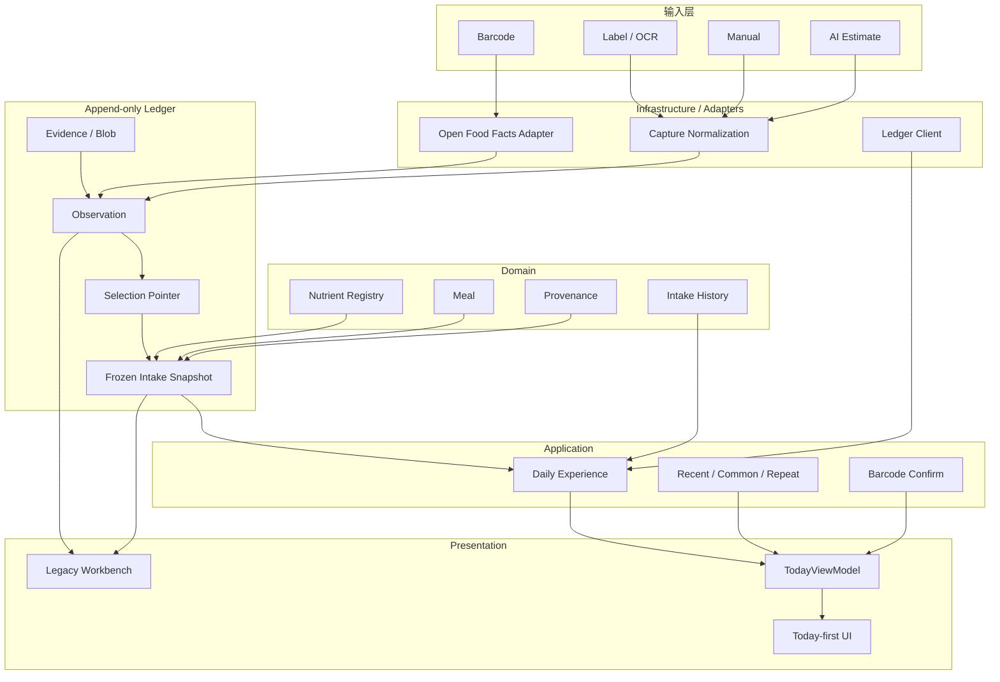
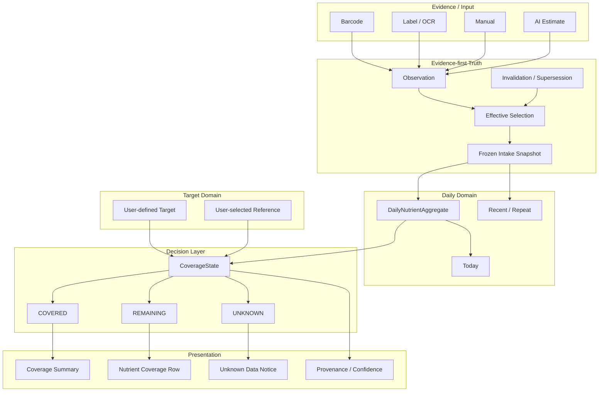
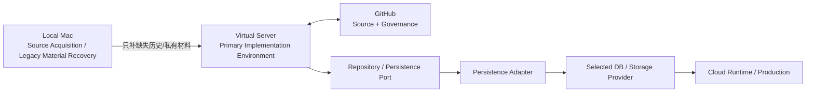

# Nutrition 当前架构 vs 理想架构

日期：2026-09-23 更新  
状态：docs-only architecture reference，不构成 runtime 变更。

## 0. 当前状态

```text
main = 298cd1f1e46a62d1cd83efca79be73edbadd6c32
test = 244f4c188993e0633833a0b9fd936afedb29605c
consumer = CONSUMER_VERIFIED
worktree = 1
local branches = 0
Day 1 = PASS
Day 2 = PASS
Day 3–7 = PENDING
#28 correction = CANDIDATE_VERIFIED / INTEGRATION_DEFERRED
#26 Coverage = BLOCKED ON #18 + #28
Production = NOT PROMOTED
```

## 1. 当前已实现架构



## 2. 当前数据流硬规则

```text
raw evidence/provider
→ observation
→ effective selection
→ frozen intake snapshot
→ daily read model
→ Today UI
```

UI 禁止：
- 直接修改历史 observation；
- 从 DOM 推导营养事实；
- 直接拼 provider 结果；
- 把缺失值默认为 0；
- 把 AI estimate 当 verified。

## 3. Correction

历史 parser bug 暴露的 correction gap 当前仍为 candidate：

https://github.com/EOMZON/nutrition-ledger-mvp/issues/28  
https://github.com/EOMZON/nutrition-ledger-mvp/pull/29

candidate SHA：
`60b8dc0fbc7056b6b359f05149c4cf0c71e84fe9`

7-day dogfood 期间不切 test，不改变 live writer。Day7 / integration 后再决定吸收。

## 4. 理想最终产品架构



### Persistence / Environment Boundary



这里必须区分：

```text
Local data location != implementation environment
Local Mac != Primary Implementation
Virtual Server != Provider
GitHub != Production
```

当前数据可能仍位于 Mac，但后续实现应尽可能在 Virtual Server 完成。

## 5. 核心不变量

```text
UNKNOWN != 0
UNKNOWN != REMAINING
invalidated observation != deleted history
target change != rewrite historical intake
AI estimate != verified truth

Domain != Database
UI != Persistence
Projection != Presentation
Virtual Server != Provider
```

## 6. Current → Ideal Gap

| 层 | Current | Ideal | 下一 Gate |
|---|---|---|---|
| Capture | 基本完成 | 日用低摩擦 | Day3–7 / #18 |
| Provenance | 完成 | 全链可解释 | 继续 dogfood |
| Correction | verified candidate | integrated + real correction | Day7 后 / #28 |
| Daily | Day1/2 PASS | 7-day natural use | #18 |
| Coverage | 未实现 | Covered/Remaining/Unknown | #18 + #28 / #26 |
| Implementation env | 历史依赖 Mac runtime | Virtual Server primary | P0 / #34 |
| Source acquisition | Mac 存部分历史材料 | source request contract | P1 / #34 |
| Provider access | GitHub known / provider unknown | least-privilege capability | #96 / #169 |
| Persistence | JSONL | Port + Adapter | Database Selection 后 |
| Remote DB | 未决定 | selected + explicit allocation | #96 / #169 |
| Recovery | 需补证据 | backup + restore rehearsal | Coverage/Beta 前 |
| Shared Domain | 未 admission | explicit admission gate | 保持 blocked |
| Beta | 未开始 | 5–10 用户 | Coverage 后 |
| Production | 暂停 | exact SHA + consumer + rollback | #59 |

## 7. ToDo / execution dependency

```text
#18 Day7
   ↓
#28 correction integration decision
   ↓
Database Selection (#96 / #169)
   ↓
Virtual Server minimum provider permission
   ↓
Persistence Port / Adapter
   ↓
backup / restore rehearsal
   ↓
mirror / read-verify
   ↓
controlled cutover
   ↓
consumer readback
   ↓
#26 Coverage / Beta
   ↓
#59 Release Gate
```

Database Selection 不得作为停止 daily capture 的理由。

## 8. Data continuity / migration rule

任何 future persistence migration 必须：

1. 保持现有 daily writer，直到 target 可验证。
2. 建立 backup/export 与 snapshot boundary。
3. 明确 source exact SHA + data snapshot。
4. adapter first，避免 UI / domain 直接绑定 provider。
5. mirror/read-verify。
6. restore rehearsal。
7. controlled cutover。
8. rollback window 保留 source。
9. consumer readback。
10. 出现 mismatch 时 fail closed。

## 9. Worktree / Merge Synchronization

必须区分：

```text
git worktree count
!= machine-wide clone count
!= consumer freshness
!= private data continuity
```

以及：

```text
SOURCE_SAVED
!= MERGED
!= SEMANTICALLY_RECONCILED
!= TARGET_VERIFIED
!= CONSUMER_UPDATED
```

参考：
- https://github.com/EOMZON/codex-skills-private/blob/task/issue-governance-20260920/github-ops/references/issue-governance.md
- https://github.com/EOMZON/codex-skills-private/blob/9a8e385ccc98f068b0990133f9a2e80681ffa9ec/github-ops/references/test-main-governance.md
- https://github.com/EOMZON/codex-skills-private/blob/main/worktree-audit/SKILL.md
- https://github.com/EOMZON/codex-skills-private/blob/main/worktree-audit/references/merge-reconciliation.md
- https://github.com/EOMZON/codex-skills-private/blob/main/worktree-audit/references/post-merge-synchronization.md

## 10. Related Issues

### Business
- #10：https://github.com/EOMZON/nutrition-ledger-mvp/issues/10
- #18：https://github.com/EOMZON/nutrition-ledger-mvp/issues/18
- #26：https://github.com/EOMZON/nutrition-ledger-mvp/issues/26
- #28：https://github.com/EOMZON/nutrition-ledger-mvp/issues/28
- #33：https://github.com/EOMZON/nutrition-ledger-mvp/issues/33
- #34：https://github.com/EOMZON/nutrition-ledger-mvp/issues/34

### Cross-repo / Database
- Product Hub #95：https://github.com/EOMZON/product-hub/issues/95
- Product Hub #96：https://github.com/EOMZON/product-hub/issues/96
- CreationOS #166：https://github.com/EOMZON/creationos-os/issues/166
- CreationOS #169：https://github.com/EOMZON/creationos-os/issues/169

## 11. Local / Virtual / Cloud scope

### Local Mac
仅负责：
- Source Acquisition；
- Legacy Material Recovery；
- 保留当前 private data continuity。

不负责：
- 未来主实现；
- provider migration；
- production runtime。

### Virtual Server
负责：
- clone/worktree；
- code；
- tests；
- migration rehearsal；
- verification；
- 文档与 Git 提交。

### Cloud / Provider
负责：
- D1/R2/PostgreSQL 等 persistence；
- runtime；
- production；
- provider side effects。

任何 provider side effect 必须先经过 capability + exact-SHA + verification + consumer readback gate。

## 12. Scope

本架构文档不授权：
- 创建/删除/迁移数据库；
- 修改 production binding；
- 修改真实 private ledger writer；
- Production deploy；
- 改变 #18 dogfood baseline。

任何实际实现另开 Issue / PR，并按 Test → Verification → Main → Consumer readback 推进。
