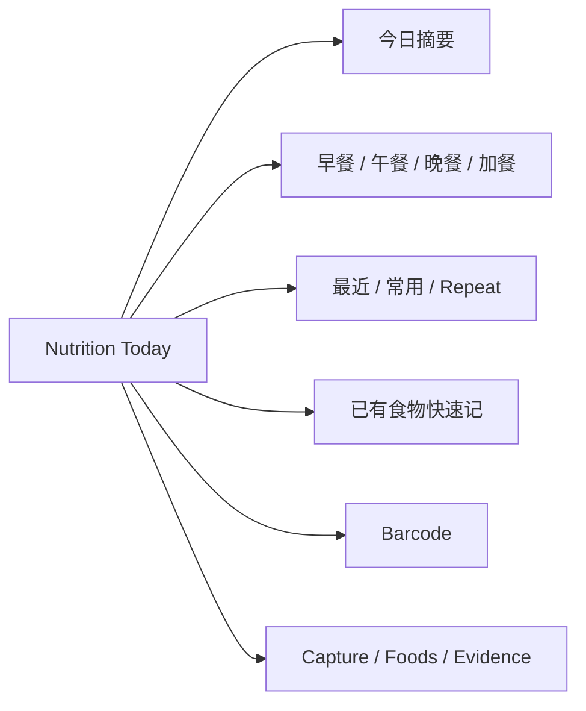
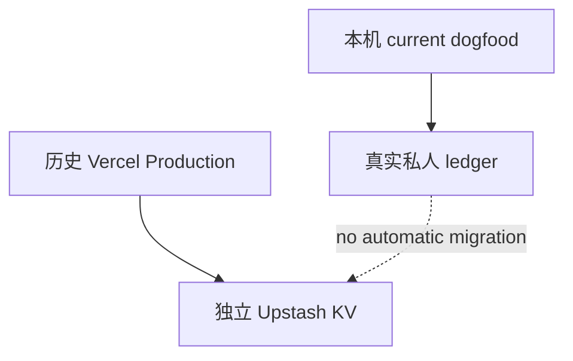
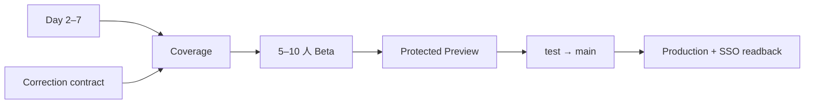

# Nutrition 当前使用方式与部署状态

日期：2026-09-18  
用途：定义“现在用户到底怎么用”和“哪些 URL 只是历史部署证据”。

## 1. 当前最新可用版本

当前最新已验证业务候选：

```text
test@244f4c188993e0633833a0b9fd936afedb29605c
```

真实 canonical：

```text
/Users/zon/Desktop/MINE/html/nutrition-ledger-mvp
```

当前真实 dogfood 使用本机：

```bash
cd /Users/zon/Desktop/MINE/html/nutrition-ledger-mvp
npm start
```

打开：

```text
http://127.0.0.1:8789
```

`npm start` 当前执行：

```text
node p1-server.mjs
```

## 2. Today-first 日常使用路径

### 已有食物

```text
Today
→ 已有食物 · 快速记
→ 食物
→ 份量
→ 餐次
→ 加入 Today
```

Day 1 实测约 3 秒。

### 快速重复

```text
Today
→ 最近吃过 / 近 30 天常用
→ 一键重复
```

产生新的 intake，不修改历史记录。Day 1 实测约 2 秒。

### 包装食品

```text
Today
→ 包装食品 · 条码
→ 查询 Open Food Facts
→ 检查候选
→ 食用量 + 餐次
→ 确认并加入 Today
```

Open Food Facts 是社区数据库；精度重要时以真实包装标签为准。

### 新食物 / 标签

```text
Capture
→ 新建食物
→ 标签图片 / OCR 文本
→ 解析
→ 校对
→ 写 observation
→ 可立即加入 Today
```

### 深度校对

```text
Foods
→ 当前有效值
→ History
→ 查看来源 / evidence
→ 使用历史值或追加新值
```

历史 correction 继续遵循 append-only。

## 3. 当前 UI 架构



## 4. 当前是否已经上线？

### 最新 P1：没有正式 Production promotion

当前：

```text
test = 244f4c188993e0633833a0b9fd936afedb29605c
main = 298cd1f1e46a62d1cd83efca79be73edbadd6c32
```

最新 Today P1、NRV parser fix 与真实 dogfood 后修正仍在 `test`，没有执行：

```text
test → main
Production deploy
```

因此当前状态：

```text
latest P1 Production = NO
```

## 5. 历史 Vercel 部署证据

2026-08-31 曾完成 local → Preview → Production 发布梯度。

历史 Preview：

```text
https://nutrition-ledger-rrle6ykd4-zons-projects.vercel.app
```

当时验证：
- HTTP 200；
- KV enabled；
- 完整写入 E2E 5 passed。

历史受保护 Production：

```text
https://nutrition-ledger-1ovaqt78p-zons-projects.vercel.app
```

当时验证：
- Vercel SSO protection；
- unauthenticated → 302；
- authenticated → 200；
- read-only canary。

曾有稳定 alias：

```text
nutrition-ledger-mvp.vercel.app
```

当时发现绕过 SSO，因此已删除；历史证据中确认删除后为 404。

完整历史证据：

https://github.com/EOMZON/nutrition-ledger-mvp/blob/test/docs/analysis/2026-08-31-production-release.md

## 6. 重要边界：历史部署 != 当前最新线上

不能从历史证据推导：

```text
旧 deployment 现在仍在线
或
当前 P1 已部署
```

当前没有最新 Vercel provider readback，因此状态必须保持：

```text
historical Production evidence = YES
current historical deployment availability = UNVERIFIED
latest P1 Production = NO
```

Release Gate：

https://github.com/EOMZON/creationos-os/issues/59

## 7. 重要边界：云端数据 != 本机私人 ledger

2026-08-31 Production 使用独立 Upstash Redis prefix：

```text
nutrition-ledger-production
```

而本机 private data 未上传、未迁移。



因此当前真实私人记录入口仍然是：

```text
http://127.0.0.1:8789
```

## 8. 为什么暂不发布最新 P1

当前 Gate：

1. #18 Day 2–7 真实 dogfood；
2. #28 append-only historical correction；
3. #26 Coverage（进入 Beta/发布候选前按产品决策实现）；
4. #59 Vercel / main / Production release gate。

## 9. 未来正确的上线顺序



Preview / Production 都必须重新做 provider readback，不能复用 2026-08-31 的旧 URL 证明当前版本。
